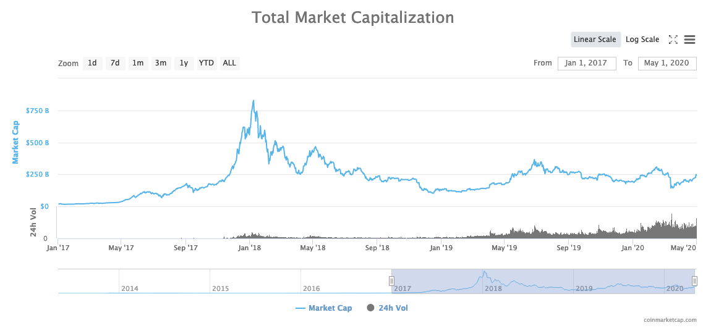
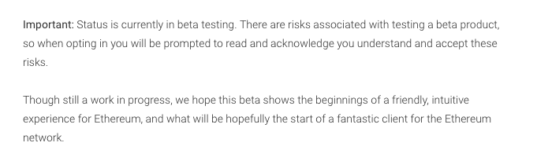

# 5. Designing Through Blockchain 

The particular technical characteristics of blockchain technology,
namely, decentralisation and auditability, have now entered the
collective imagination and are changing the ways in which certain
problems are approached. Some projects that were previously
technically feasible but had not been applied have now been
implemented thanks to an increasing awareness of the possibilities. We
call this movement 'designing through blockchain'.

This chapter explores this phenomenon by analysing the evolution of
blockchain technology and the way in which it has developed into its
own economic sector. We explore two fields that have undergone major
conceptual and formal upheaval as a result of being viewed through the
prism of blockchain: regulatory techniques and identity recognition.

## 5.1. The emergence of a new sector 

The development of blockchain has not been homogeneous. Two separate
movements can be distinguished: projects that directly target the
general public and mass markets and uses of blockchain aimed at the
business sector.

Since 2017, blockchain technology has developed into a significant
social phenomenon. Bitcoin in particular has been extensively
discussed in the media. A large number of people have begun buying
cryptocurrencies on trading platforms. In absolute terms, the amounts
are dizzying, with market cap levels now exceeding US\$ 100 billion
(Figure 10). Beyond these initially impressive figures, it is still
difficult to measure the true scope of the technology.

Figure 10. Total market capitalisation according to coinmarketcap.com.

Most of the funds raised by ICOs have been directed towards technical
projects. Some of these have focused on technical improvements, others
on entirely new blockchain systems. Some have promised to provide
specific applications for end users, not just new tools for
developers. According to the goals they have set for themselves, many
of these projects are due to start delivering services soon. These
future services can be expected to be made available for use by the
public, albeit primarily as beta versions.

We can observe both economic models and a methodology based on a
culture of 'perpetual prototyping', key features of the start-up
culture of the information technology industry. In this sense projects
have evaded responsibility for future technical issues as well as for
defining the real value of the end use of their product. The language
of prototypes and betas has its own marketing value in appealing to
*early adopters* (the first users of a service). It also serves to
protect companies in legal terms and to guard against disappointment
from end users (Figure 11).

Figure 11. Warning message for the Status mobile app on Android
PlayStore.

There is in fact a good deal of uncertainty surrounding the actual
value and usefulness of these new services. While blockchain can be
seen as an important social phenomenon, its use remains marginal. The
few major exceptions are Bitcoin and a few other cryptocurrencies used
for speculative purposes.

The latter are also used to store and transfer web-based assets. In
countries in which significant, if perhaps temporary, capital control
measures have been implemented, their use may increase significantly.
Examples might be observed within the capital flow restrictions
imposed in Venezuela in 2019 and in Greece in 2015. The same is true
for countries experiencing high rates of inflation. When a country's
financial infrastructure is experiencing difficulties,
blockchain-based cryptocurrencies begin to find uses in the real
economy.

Another possible use lies in humanitarian aid, such as when aid
struggles to reach its destination due to corruption or is severely
diminished by overheads and administrative costs charged by
intermediaries. Blockchain technology provides a much more direct
system, one that also allows transactions to be tracked. Its use is
already being explored by organisations including the United Nations,
World Economic Forum (WEF), UN Refugee Agency (UNHCR), World Food
Programme (WFP), International Committee of the Red Cross (ICRC), and
IBM. In 2017, the WFP launched a pilot project called Building Blocks,
which began by assessing key assumptions around the capacity of
blockchains to authenticate, record, and reconcile cash and food aid
transactions in Pakistan. By 2018, the WFP reported that Building
Blocks was able to facilitate money transfers while protecting
beneficiary data, controlling financial risk and reducing costs by
eliminating up to 98% of the fees charged by third-party institutions.
The project is expected to speed up the implementation of emergency
assistance operations.

These new opportunities are beginning to raise questions about
monetary policy and sovereignty. The Open Money Initiative, an
independent initiative funded by a number of blockchain players along
with the Human Rights Foundation, examines how people use money in the
context of closed economies and collapsing monetary systems, for
instance in Venezuela (Figure 12).

Figure 12. Tweet from the Open Money Initiative showing a woman hiding
money in her hair.

Some institutional actors with strong user bases, such as Facebook and
Telegram, are creating their own cryptocurrencies for integration into
their platforms. The marketing campaign for the Facebook consortium's
cryptocurrency project Libra states that it will be aimed at people
who do not have access to traditional financial services (the
'unbanked') and countries whose national currencies are weak. Libra
will likely be pegged to the US dollar and made available as a payment
tool on popular messaging applications such as Facebook, WhatsApp, and
Messenger as well as the Instagram photo-sharing application. The
Telegram app is also launching a cryptocurrency. The situation is
similar to that of a highly financed market: Many promises have been
made, but there are currently few deliverables available.

A wide range of actors, including companies and institutions, have
attempted to take advantage of these new opportunities. The business
sector has its own specific approach to blockchain. Solutions that
were developed by and for private companies are primarily intended to
improve existing processes and mostly involve permissioned
blockchains. These types of blockchains can be distinguished according
to their modes of governance, which can be centralised or by
consortium.

In centrally controlled blockchains, each member must be approved by the
central body, and transactions can only be validated by the central
body. The database is shared between a number of different actors, but
only the central body can regulate it. The use of blockchain in these
cases does not constitute a major divergence from the use of existing
technologies, but it does enable companies to familiarise themselves
with the new technology. We do not focus further on this type of usage.

The situation is different where blockchains are governed by
consortiums. In this case, each member owns and controls a node and
can validate transactions. The structure imitates that of a public
blockchain, but with a restricted number of selected members. This
profoundly changes the ways in which cooperation is approached.

The consortium approach avoids responsibility being placed on a
central actor. Conventional information exchange procedures without
third parties often require data to be verified and reconciled by each
participant, meaning the data structure must be standardised. When
discrepancies are discovered, a tedious bureaucratic process is
triggered, one which can sometimes end up in the courts.

In consortium blockchains, the blockchain modifies the relationship
between actors by placing a distributed ledger system in the middle.
The collaboration process is designed around this centralised element.
The structure of the information recorded in the blockchain, as well
as the validation rules, are therefore the primary focus of
discussions. For example, organisations may decide that at least 70%
of the nodes, not just a simple majority, must validate a block for it
to be accepted.

This enables new situations to come about. One concrete example
involved the declaration of bicycle thefts in Amsterdam: A common
ledger for the owners, the insurance companies and the police was
established using a blockchain to enable the various parties to manage
their tasks in the event of a theft such as complaint filing,
registration of the complaint, and insurance payout. The government
could also have set up a centralised database and invited the other
parties to use it, but this was not done before blockchains could be
used to create ledgers of this type. Blockchain has brought many
actors to the table and focused them on the modelling of transactions,
processes, actors and objects.

Established IT industry players like IBM, Google, and Microsoft
provided the infrastructure required to deploy these services. New
actors like we.trade and sana.swiss modelled particular situations in
attempts to provide turnkey services to companies, saving them from
having to do the modelling and development work themselves. Thus, we
are seeing the emergence of an industry that is changing the way
companies approach relationships and information sharing with their
partners.

## 5.2. New regulation techniques 

Blockchain is prompting a re-assessment of responsibilities related to
regulation. Here, we address the issue of responsibility from the
point of view of service providers and regulatory institutions.

The ability to access content, whether in transit or in storage,
carries with it a certain amount of responsibility. Encryption systems
have already partially removed this burden in certain situations:
Access providers are no longer aware of the content of TLS-protected
web pages; chat services with 'end-to-end encryption' have no access
to the content of the messages sent over their networks.

Where intermediaries are no longer able to read content, they no
longer have to bear responsibility for that content. The end user of
the service becomes the sole responsible party.

In the same way, a blockchain can be used to provide monetary services
without having the capacity to discover the nature of each
transaction. A dual phenomenon can therefore be observed: Users are
lobbying for the protection of their privacy, while IT service
providers are reluctant to take on the role of service regulator.

Censorship capabilities bring with them significant levels of
responsibility, and there are costs associated with managing
censorship rules and legislation. Reputational and political costs are
associated with the use of platforms for some types of material, such
as political or pornographic material. Third parties managing
transactions are in direct competition with other systems that manage
the same types of transactions without taking responsibility for them.
In this context it might be advantageous for these third parties to
reduce content regulation.

The United States has been considering abandoning the last few
controls it exercises over domain names. This issue has been on the
table since the 1990s. In 2012, China, India and Russia came together
to demand equal rights in the regulation of the internet. Global
pressure has increased in recent years, in particular following the
Snowden affair. ICANN, the regulatory authority in charge of domain
names, is itself demanding independence from the US government. The
United States has recognised ICANN as an effective and mature
multipartite organisation and has tasked it with bringing the global
community together to address the process of transitioning to a global
consensus mechanism. In this context, ICANN published a report in
which it explores decentralised systems, possibly based on blockchain
technology, using Bitcoin and Namecoin as examples.

New actors are also taking on new responsibilities. So-called oracle
services, such as Chainlink and Provable, incorporate external data,
including traditional financial information such as interest rates and
prices, into blockchains. This means that commercial transactions
implemented through smart contracts and executed on blockchains can
have access to external data. These services allow for bidirectional
operation: Information on blockchains is already available externally;
through oracles, external data are now also available on a blockchain.
The reliability of an oracle and the quality of the data it provides
are therefore crucial factors.

Regulatory Technology (RegTech) is the fintech field that uses
information technology to help businesses comply with regulatory
requirements. The number of technical solutions available have
multiplied rapidly, particularly following the financial crisis of
2008. The certification capabilities of blockchain systems are now
enabling this industry to offer new services.

## 5.3. Identity paradigms 

The concept of a person's identity can be understood as the principle
of recognition, both by the person themselves and by others. Each
individual is given a name at birth. Names, in conjunction with
nationality, sex, and place and date of birth, constitute the basic
elements of recognising a legal identity of each person.

Governments have established systems for proving one's legal identity,
including passports and requirements for handwritten signatures. Most
are now designing modern digital identification systems, such as ID
that can be presented to prove one's identity on the internet, in
similar ways.

Internet services, however, including blockchain-related services, are
transforming the ways in which we conceive of a person's identity in a
transaction. The identity of an individual is rarely verified. Most
transactions dispense with a full legal identity check and only verify
certain attributes, such as age, email address, or payment method.
Identity management is gradually shifting towards the verification the
attributes of individuals. There is a gradual shift from *who* someone
is to *what* they are.

Accessing a public blockchain does not require specific identification
procedures. Everyone is free to create a new account in order to
receive and manage funds. Each account is associated with a key which
is used to authenticate users and enables them to operate on the
blockchain according to the established set of rules. Each operation,
whether it is sending funds or adding a smart contract, is digitally
signed by this account. This creates a chain of transactions related
to a particular account.

Unlike traditional financial services, which demand that users provide
formal identity documents before accessing the service, the members of
a blockchain can use its services without authorisation from a third
party. This is fairly common on the internet, where the creation of
user accounts rarely requires strong identification. Most internet
services have terms and conditions that must be accepted, and email
addresses and phone numbers may also be requested to enable the person
to be identified after the event, if necessary. Terms and conditions
do not need to be accepted to use a public blockchain. Their technical
configurations actually limit the actions available.

People's identities emerge through their actions. A person's activity
on a merchant site like eBay or Airbnb can be established through
their transaction history. Identities can be established on
blockchains in the same way, through recognition.

A person can perform actions using multiple accounts on a number of
different blockchains. The transactions performed through each account
will be separate, but the different accounts can be unified under a
single identity through the addition of a message recognising the
person's activity on another system. The keybase.io service has
already unified its users' identities using this principle by
associating their social media identities with encryption keys. The
person controlling the account digitally signs a message on each
platform, proving that they are the same person.

This means that once someone has legally identified themselves on a
blockchain, all transactions on this blockchain are legally
identified. It also potentially enables them to legally prove their
identity on other blockchains and other systems.

Figure 13. In each blockchain you write a message that identifies your
key in the other blockchain. This proves you have access to both keys.

This distinction between an identity used on a network and an
administrative identity endowed by a body external to the individual
is extremely pertinent to discussions of the recognition bestowed on
an individual and what that individual is authorised to do.

The shift towards the decentralised administration of identity makes
this still more relevant. Identity can now be expressed in ways that
are very different from its conventional legal expression. The most
common digital identifiers used today are email addresses and
usernames, such as Facebook and Twitter IDs. They place identification
providers in a position of control over each of a person's digital
transactions. Various proposals have been put forward in an attempt to
change this situation, including the concept of self-sovereign
identity. This administration technique gives individuals and
organisations exclusive ownership of their digital and analogue
identities as well as control over how their personal data are shared
and used. Zero-knowledge proofs are also used to demonstrate the
veracity of information without it being shared. For example, we can
rent a car because we have the legal capacity to do so in terms of age
and possession of the appropriate licence and insurance, but we simply
attest to this capacity, without furnishing its details. This approach
necessarily implies a change in the relationship between personal data
and the identities associated with it. It generally questions the
rights, recognition, responsibilities, and status of the individual in
the public informational space.

